# AI Sandbox Behavior Map

This document records the behavior of the AI UI sandbox at `/playground`.
It is based on a live browser review of every isolated slider state and the
two input-capability states.

## Baseline

The default launch-review assistant starts with:

- Input capability: `Text + image`
- Uncertainty handling: `Review recommended`
- Permission level: `Suggest tasks`
- Memory: `This chat`
- Transparency: `Evidence`

The interface shows a cover-image attachment, visual-review result, launch
checklist, review notice, optional QA-task suggestion, evidence disclosure,
and temporary session-context panel.

## Behavior Diagram

```mermaid
flowchart TD
  A["Launch-review assistant"] --> C["Input capability"]
  A --> U["Uncertainty handling"]
  A --> P["Permission level"]
  A --> M["Memory"]
  A --> T["Transparency"]

  C --> C0["Text only"]
  C0 --> C0A["Show unsupported-image alert"]
  C0 --> C0B["Remove attachment and image analysis"]
  C0 --> C0C["Disable image attachment"]
  C --> C1["Text + image"]
  C1 --> C1A["Show attachment and image analysis"]
  C1 --> C1B["Add cover-image evidence"]

  U --> U0["Direct"]
  U0 --> U0A["Remove review notice"]
  U0 --> U0B["Keep concise response"]
  U --> U1["Review recommended"]
  U1 --> U1A["Show review notice"]
  U1 --> U1B["Flag two unresolved checks"]
  U --> U2["Confirmation needed"]
  U2 --> U2A["Show stronger confirmation notice"]
  U2 --> U2B["Change assistant copy before publishing"]

  P --> P0["Answer only"]
  P0 --> P0A["Remove workflow-action card"]
  P0 --> P0B["Header says answers only"]
  P --> P1["Suggest tasks"]
  P1 --> P1A["Show optional QA-task suggestion"]
  P1 --> P1B["User can add task"]
  P --> P2["Act with approval"]
  P2 --> P2A["Replace suggestion with approval card"]
  P2 --> P2B["User can review plan or approve"]

  M --> M0["Off"]
  M0 --> M0A["Header says memory off"]
  M0 --> M0B["Remove context inspector"]
  M0 --> M0C["Remove memory evidence item"]
  M --> M1["This chat"]
  M1 --> M1A["Show temporary session-context panel"]
  M1 --> M1B["Add session-context evidence item"]
  M --> M2["Saved preferences"]
  M2 --> M2A["Show retained-preference panel"]
  M2 --> M2B["Expose removable preferences"]

  T --> T0["Quiet"]
  T0 --> T0A["Remove evidence disclosure"]
  T --> T1["Evidence"]
  T1 --> T1A["Show collapsed evidence control"]
  T --> T2["Instrumented"]
  T2 --> T2A["Open evidence list automatically"]
  T2 --> T2B["Add current-state inspector"]
```

## Isolated State Review

| Control | State | Visible UI consequence | Assessment |
| --- | --- | --- | --- |
| Input capability | `Text only` | Unsupported-image alert appears. Attachment and image-analysis card disappear. Attach button is disabled. Evidence count drops. Assistant copy falls back to written-brief review. | Clear, but the session-context copy still incorrectly mentions the attached image. |
| Input capability | `Text + image` | Attachment, image-analysis card, and cover-image evidence appear. | Clear and logical. |
| Uncertainty | `Direct` | Review notice disappears. Response posture says `Direct`. | Logical but visually subtle. The changed-note text does not explain this state. |
| Uncertainty | `Review recommended` | Review notice flags two unresolved checks. | Clear and logical. |
| Uncertainty | `Confirmation needed` | Stronger notice appears and assistant copy asks for confirmation before publishing. | Clear and logical. |
| Permission | `Answer only` | Workflow-action card disappears. Header says `Answers only`. | Clear, but the changed-note text still mentions a suggested task. |
| Permission | `Suggest tasks` | Optional QA-task card appears with a working `Add task` action. | Clear and logical. |
| Permission | `Act with approval` | Approval card replaces the suggestion. `Review plan` and approval actions appear. | Clear pattern, but approval copy promises two tasks while the action adds one. |
| Memory | `Off` | Header says `Memory off`. Context inspector disappears. Evidence count drops from three to two. Workspace becomes single-column. | Clear and logical. The changed-note text does not explain this state. |
| Memory | `This chat` | Header says `This chat only`. Temporary session-context panel appears. Session-context evidence is available. | Clear and logical. |
| Memory | `Saved preferences` | Header and inspector change to retained preferences. Preferences become removable. | Clear and logical. |
| Transparency | `Quiet` | Evidence disclosure disappears. Memory disclosure remains visible when memory is enabled. | Logical. The changed-note text should explicitly explain that supporting evidence is hidden. |
| Transparency | `Evidence` | Collapsed `Show evidence` control appears. | Clear and logical. |
| Transparency | `Instrumented` | Evidence opens automatically and a current-state inspector appears. | Clear and logical. |

## Combined Extremes

### Compact Answer-Only State

When all sliders are set to their lowest values:

- Review notice disappears.
- Workflow-action cards disappear.
- Memory inspector disappears.
- Evidence disclosure disappears.
- Header becomes `Answers only` and `Memory off`.
- Core chat, visual review, checklist, inline editing, feedback, and composer remain.

This is a credible compact assistant mode.

### Instrumented Approval State

When all sliders are set to their highest values:

- Confirmation notice and cautious assistant copy appear.
- Approval card replaces the optional suggestion.
- Saved preferences become visible and removable.
- Evidence opens automatically.
- Current-state inspector lists input, memory, permission, and evidence count.

This is a credible oversight-oriented mode for a more autonomous assistant.

## Improvement Queue

### Must Fix

1. Make session-context copy capability-aware. In `Text only`, do not claim the
   attached cover image is being used.
2. Align approval copy and behavior. The card promises two QA tasks, while the
   current approval action adds one.
3. Make the `What changed` note describe the control the visitor just changed.
   It currently falls back to an unrelated default note for several low states.

### Consider

1. Clarify whether the original cover-image prompt should remain visible after
   selecting `Text only`. Keeping it can demonstrate a capability mismatch, but
   the UI should make that intent explicit.
2. Strengthen the `Direct` uncertainty state slightly. Removing the warning is
   logical, but the difference is quieter than the other uncertainty states.
3. Consider labeling the independent memory panel more explicitly when
   transparency is `Quiet`, so visitors understand why memory disclosure remains
   visible while evidence disclosure disappears.

