# AI Sandbox Behavior Map

This document records the verified behavior of the AI UI sandbox at
`/playground`. Each slider state was reviewed independently in the browser.

## Baseline

The default launch-review assistant starts with:

- Input capability: `Text + image`
- Uncertainty handling: `Review recommended`
- Initiative level: `Suggest next steps`
- Access scope: `Read workspace`
- Memory: `This chat`
- Transparency: `Evidence`

The baseline UI shows an attached cover image, visual-review result, launch
checklist, review notice, optional QA-task suggestion, evidence disclosure,
read-only project-file scope, and temporary session context.

## Behavior Diagram

```mermaid
flowchart TD
  A["Launch-review assistant"] --> C["Input capability"]
  A --> U["Uncertainty handling"]
  A --> I["Initiative level"]
  A --> S["Access scope"]
  A --> M["Memory"]
  A --> T["Transparency"]

  C --> C0["Text only"]
  C0 --> C0A["Show unsupported-image alert"]
  C0 --> C0B["Remove attachment and visual review"]
  C0 --> C0C["Use written-brief session context"]
  C --> C1["Text + image"]
  C1 --> C1A["Show attachment and visual review"]
  C1 --> C1B["Add cover-image evidence"]

  U --> U0["Direct"]
  U0 --> U0A["Remove review warning"]
  U --> U1["Review recommended"]
  U1 --> U1A["Flag unresolved checklist items"]
  U --> U2["Confirmation needed"]
  U2 --> U2A["Show stronger warning"]
  U2 --> U2B["Ask for confirmation before publishing"]

  I --> I0["Respond only"]
  I0 --> I0A["Remove unsolicited next steps"]
  I --> I1["Suggest next steps"]
  I1 --> I1A["Offer optional QA task"]
  I --> I2["Proactive"]
  I2 --> I2A["Surface prepared task for detected risk"]

  S --> S0["Chat only"]
  S0 --> S0A["Use messages and attachments only"]
  S0 --> S0B["Remove project-file scope"]
  S --> S1["Read workspace"]
  S1 --> S1A["List two scoped project files"]
  S1 --> S1B["Declare read-only access"]
  S --> S2["Propose writes"]
  S2 --> S2A["Show affected files"]
  S2 --> S2B["Review diff"]
  S2 --> S2C["Approve or undo scoped edits"]

  M --> M0["Off"]
  M0 --> M0A["Remove context panel and memory evidence"]
  M --> M1["This chat"]
  M1 --> M1A["Show temporary context"]
  M --> M2["Saved preferences"]
  M2 --> M2A["Show removable retained preferences"]

  T --> T0["Quiet"]
  T0 --> T0A["Hide supporting evidence"]
  T --> T1["Evidence"]
  T1 --> T1A["Show collapsed evidence disclosure"]
  T --> T2["Instrumented"]
  T2 --> T2A["Open evidence list"]
  T2 --> T2B["Show input, memory, initiative, and access state"]
```

## Isolated State Review

| Control | State | Visible UI consequence |
| --- | --- | --- |
| Input capability | `Text only` | Unsupported-image alert appears. Attachment and visual review disappear. Attach is disabled. Session context switches to written brief only. |
| Input capability | `Text + image` | Attachment, visual review, and cover-image evidence appear. |
| Uncertainty | `Direct` | Review warning disappears. Response posture becomes concise. |
| Uncertainty | `Review recommended` | Review warning flags two unresolved checklist items. |
| Uncertainty | `Confirmation needed` | Stronger warning and cautious assistant copy ask for confirmation before publishing. |
| Initiative | `Respond only` | Optional next-step card disappears. Header says the assistant responds when asked. |
| Initiative | `Suggest next steps` | Optional QA-task card appears with a working `Add task` action. |
| Initiative | `Proactive` | A prepared QA task appears when the assistant notices a launch risk. Add and undo work. |
| Access scope | `Chat only` | Header and alert declare the boundary. Workspace-file scope disappears. Messages and attachments remain usable. |
| Access scope | `Read workspace` | Inspector lists two scoped files and clearly states that project files cannot be modified. |
| Access scope | `Propose writes` | A write proposal lists affected files. Visitors can review the diff, approve the edits, see applied state, and undo the write. |
| Memory | `Off` | Context panel disappears and memory is removed from evidence. |
| Memory | `This chat` | Temporary session-context panel appears. |
| Memory | `Saved preferences` | Retained preferences appear with working removal actions. |
| Transparency | `Quiet` | Evidence disclosure disappears. Necessary access and memory controls remain visible. |
| Transparency | `Evidence` | Collapsed evidence disclosure appears. |
| Transparency | `Instrumented` | Evidence opens automatically. Current-state inspector adds input, memory, initiative, access, and evidence count. |

## Interaction Principles

### Initiative Is Not Access

An assistant can proactively surface a useful task without receiving additional
machine access. The initiative slider changes behavioral posture. It does not
grant permissions.

### Access Is Scoped And Reversible

Machine access progresses from messages and attachments, to explicit read-only
files, to proposed writes. Proposed edits identify affected files, require
approval, expose a diff, and remain reversible.

### Transparency Is Contextual

Quiet mode hides supporting evidence, but it does not hide access scope or
persistent-memory controls. Those surfaces are necessary for informed consent.

## Verified Actions

- Add and undo suggested QA task.
- Add and undo proactive prepared task.
- Review write diff.
- Approve scoped metadata write.
- Undo applied write.
- Remove and restore image attachment.
- Remove saved preference.
- Expand and collapse evidence.
- Regenerate, edit, and rate assistant response.
- Send local follow-up prompt.
- Reset the sandbox.

